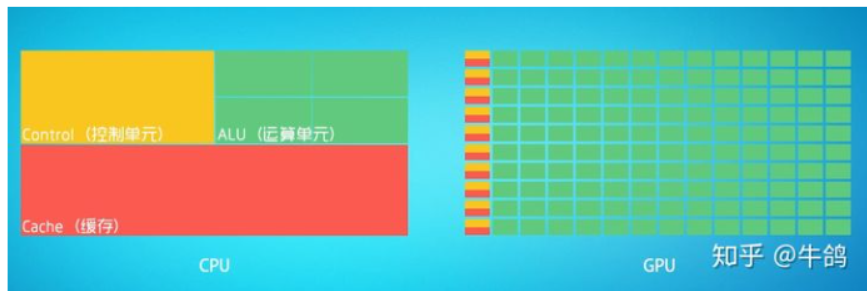

[toc]

# 什么是 PyTorch？
PyTorch 是基于以下两个目的而打造的python科学计算框架：

无缝替换NumPy，并且通过利用GPU的算力来实现神经网络的加速。
通过自动微分机制，来让神经网络的实现变得更加容易。

#  什么是torchvision

> 见`./MD/torchvision.md`

# 什么是torchaudio
> 见`./MD/torchaudio.md`

# [教程链接](https://pytorch.apachecn.org/#/docs/1.7/02)

# 一些可能需要复习的前置知识
自我强劲总结，分为以下几个部分吧

## [GPU 与 CPU 的区别？](https://zhuanlan.zhihu.com/p/156171120)

1、CPU和GPU的内部构成和原理
2、GPU和CPU的特点分别是什么？
3、GPU和CPU的适用场景是什么？
1、CPU和GPU的内部构成区别

### 0、CPU和GPU的不同架构

如上是CPU和GPU的内部构成，可以看出是由不同的架构所组成

————————————————————

CPU：叫做中央处理器（central processing unit）作为计算机系统的运算和控制核心，是信息处理、程序运行的最终执行单元。[1]
可以形象的理解为有25%的ALU(运算单元)、有25%的Control(控制单元)、50%的Cache(缓存单元)

因为CPU涉及到通用计算，复杂度较高，——总结成少量的复杂计算

需要少量的运算单元，强大的逻辑运算能力，可以理解为4个专家，既可以做奥数题，也可以做加减法
需要足够的控制单元实现复杂的数据控制和数据转发
需要足够的缓存单元去存放一些已经计算完成的结果，或者是后面马上要用到的数据
————————————————————

GPU：叫做图形处理器。图形处理器（英语：Graphics Processing Unit，缩写：GPU），又称显示核心、视觉处理器、显示芯片，是一种专门在个人电脑、工作站、游戏机和一些移动设备（如平板电脑、智能手机等）上做图像和图形相关运算工作的微处理器。[2]
可以形象的理解为90%的ALU(运算单元)，5%的Control(控制单元)、5%的Cache(缓存单元)

### 1、GPU的设计原理——总结为大量的简单运算

大量的运算单元：负责简单粗暴的计算，不擅长奥数题，但小学题他会
少量的控制单元和缓存单元：主要是负责合并和转发数据，对这两块的需求较小，所以占据GPU较小的空间
————————————————————

### 2、GPU和CPU的特点分别是什么？
#### 2.1、计算量比较

CPU：计算量小，原理：只有4个运算单元
GPU：计算量大，原理：有1000个运算单元

#### 2.2、计算复杂度比较：

CPU：可计算复杂的运算，比如积分微分，4个运算单元都属于专家级别
GPU：只可以计算简单的1+1算术题，不能计算复杂的微分积分，1000个运算单元属于小学生水平。

#### 2.3、对于单个积分微分的计算速度比较

CPU：较快。原理：单线程计算（比如机器人运动控制），单个芯片性能强劲，计算能力强，能计算出来
GPU：较慢，甚至可能计算不了；原理：单个芯片性能弱，计算能力弱，可能算不出来，或速度很慢
#### 2.4、对于多个1+1算术题的计算速度比较

CPU：速度较慢。因为计算原理是：先算第1题， 再算第2题，总时间为【T1+T2+T3>>>+T1000（也就是1000个算术题消耗时间的累加]）】
GPU：速度很快。因为计算原理是：可同时计算1000道算术题，总时间为【max（T1,T2,T3...T1000）（也就是1000个算术题消耗时间中的最大值）】
####  2.5、形象比喻

GPU：计算量大，但没什么技术含量，而且要重复很多很多次。就像你有个工作需要算几亿次一百以内加减乘除一样，最好的办法就是雇上几十个小学生一起算，一人算一部分，反正这些计算也没什么技术含量，纯粹体力活而已。
CPU：像老教授，积分微分都会算，就是工资高，一个老教授资顶二十个小学生，你要是富士康你雇哪个？GPU就是这样，用很多简单的计算单元去完成大量的计算任务，纯粹的人海战术。

### 3、CPU和GPU的适用场景
CPU：适合需要前后计算步骤严密关联的计算场景。这些任务涉及到“流”的问题，必须先计算完第一步，再去计算第二步；比如你去相亲，双方看着顺眼才能继续发展。总不能你这边还没见面呢，那边找人把证都给领了。这种比较复杂的问题都是CPU来做的，生活中大部分用的都是CPU，例如武器装备运动控制、个人电脑使用等

GPU：适合前后计算步骤无依赖性，相互独立的计算场景。很多涉及到大量计算的问题基本都有这种特性，比如你说的破解密码，挖矿和很多图形学的计算。这些计算可以分解为多个相同的简单小任务，每个任务就可以分给一个小学生去做

